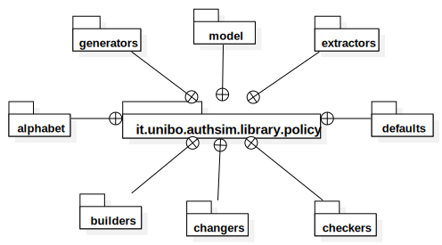
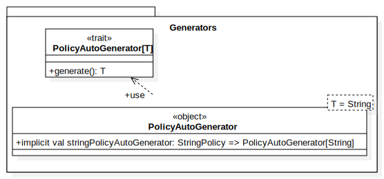
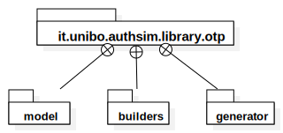
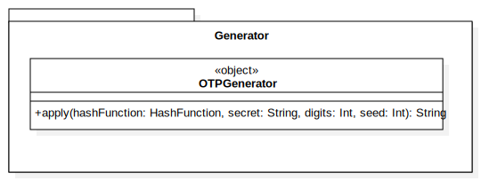

# Design di dettaglio

## Library

### `AbstractBruteForceAttackBuilder`
#### metodi `protected`
Nella classe `AbstractBruteForceBuilder` sono stati inseriti i metodi di configurazione relativi 
agli attacchi bruteforce con visibilità `protected` per permettere alle classi che la estendono di
esporre metodi con nomi più semantici: ad esempio, un attacco bruteforce basato su dizionario 
(generato dal builder `DictionaryAttackBuilder`) richiede un alfabeto in senso generico, quindi un insieme di 
parole con cui generare le stringhe (non obbligatoriamente le parole sono lunghe 1 solo carattere), 
perciò è semanticamente più corretto esporre un metodo nominato `withDictionary` rispetto a `withAlphabet`, 
infatti rispecchia il tipo richiesto dal metodo.

### `Alphabet`
#### `extends Set[String]`
Il trait `Alphabet` estende il trait dei set, in particolare specificando che si tratta di un insieme di stringhe.
Questa estensione è stata fatta per poter utilizzare (e raggiungere) il `Set` all'interno dell'alfabeto stesso 
in modo trasparente e rendere il codice meno verboso.

#### generico rispetto a sè stesso
`Alphabet` è generico rispetto a sè stesso, infatti la sua signature è `trait Alphabet[T <: Alphabet[T]`.
Questa definizione particolare è utile per aiutare il compilatore a conoscere il tipo del valore di ritorno
del metodo `and` (che unisce due alfabeti in una nuova istanza), il quale generalmente ritorna un oggetto dello stesso
tipo dell'alfabeto sul quale si chiama il metodo stesso: ad esempio, se si chiama `and` su un alfabeto di tipo
`Dictionary`, il nuovo alfabeto prodotto sarà anch'esso di tipo `Dictionary`.

### `Builder`
#### `builderMethod`
Il metodo `builderMethod` all'interno del trait `Builder` è stato inserito per rendere meno verboso il codice dei vari 
builder presenti, in quanto incapsula la restituzione del builder stesso. Ciò è stato possibile grazie alla possibilità
di Scala di accettare funzioni come argomenti per altre funzioni. `builderMethod` richiede una funzione che accetta un 
solo valore del tipo specificato e restituisce il tipo `Unit`, che normalmente si associa a una funzione di assegnamento.

### `ConcurrentStringCombinator`
#### restituisce un solo `Option[String]` per chiamata
Questa classe funge da monitor per le combinazioni di stringhe richieste. In questo modo, procedure in esecuzione in 
parallelo non interferiscono tra di loro. Inoltre, fornisce anche una condizione di terminazione, 
in quanto quando restituisce un `Option` vuoto significa che le combinazioni di stringhe richieste sono terminate.


### `Policy`
//TODO: aggiungere descrizione dei diagrammi Policy



- `Model`
  

- `Alphabet`
  

- `Builders`
  

- `Changers`
  

- `Checkers`
  

- `Defaults`
  

- `Extractor`
  

- `Generators`
  

### `OTP (One-Time Password)`
//TODO: aggiungere descrizione dei diagrammi OTP


- `Model`
  

- `Builders`
  

- `Generators`
  


## Pattern di progettazione
### `Builder` 
Il pattern `Builder` è stato usato in gran parte del framework, in quanto la maggior parte degli oggetti da costruire
non richiedevano di specificare tutti i parametri di configurazione, restituendo un oggetto di un tipo generale.
Un esempio è `BruteForceAttackBuilder`, il quale costruisce un oggetto di tipo `Attack` e non `BruteforceAttack`.

### `Chaining Method`
Il pattern `Chaining Method` è stato usato implementando i metodi dei builder con il metodo `builderMethod`,
il quale restituisce un riferimento al tipo più specifico possibile del `Builder` su cui è chiamato.
L'uso di questo pattern permette di potenziare la notazione infissa dei metodi di Scala e raggiungere una scrittura di
codice simile al linguaggio naturale.

Un esempio di ciò è la seguente stringa (fonte: `BruteForceAttackBuilderTest`):
```
(new BruteForceAttackBuilder() against myProxy usingAlphabet myAlphabet maximumLength maximumPasswordLength hashingWith HashFunction.MD5() jobs 4 logTo consumer timeout Duration.Zero).executeNow()
```
Si può vedere che la configurazione della costruzione di un attacco (cioè il codice all'interno delle parentesi tonde
più esterne) si avvicina molto alla descrizione a parole (in lingua inglese) di ciò che si richiede.

### `Decorator`
Il pattern `Decorator` è stato usato nella dichiarazione del trait `Alphabet` rispetto al trait `Set[String]` di Scala.
Infatti, oltre a estendere il trait, contiene anche un oggetto dello stesso tipo e infatti le operazioni su un alfabeto
sono delegate al set interno, di cui però non si conosce il tipo specifico.

### `Factory`
//le apply sugli object sono factories


###`Template Method`
//Cipher

//TODO: AlphabetCommonClasses.alphabenumericsymbols è template method e anche i metodi di trait RegexAlphabet e RansomAlphabet 


## Client

### Observer

// TODO UML ObservableListBuffer

### Factory


// TODO UML AttackFactory

### ScalaFx Task

La simulazione di un attacco potrebbe durare per molto tempo, quindi non sarebbe
accettabile bloccare il thread della gui con una computazione impegnativa.

La libreria ScalaFx offre `Task[T]` una classe utility analoga a `SwingWorker` che permette di
eseguire una computazione non bloccante su un thread diverso da quello di EDT.

Permette inoltre di comunicare con la GUI tramite il metodo `updateMessage` che permette di aggiornare
un StringProperty, `messageProperty`, disponibile alla GUI.

In questo modo si riesce a eseguire la simulazione e stampare su un elemento della gui i log della sua esecuzione.

L'esecuzione del task viene effettuata da un component `SimulationRunnerComponent` responsabile di avviare e di fermare il task in esecuzione.
Questa classe utilizza `ExecutorService` mono-thread (`newSingleThreadExecutor`) per gestire il task. 

// TODO UML Task e runner

### Repositories

// TODO UML SQL e Mongo Repository

### Properties Service

Nello svolgimento del progetto, 

// TODO UML properties Service e SQLRepository

## Organizzazione del codice

Il codice del progetto è diviso in due marco-package: `client` e `library`

### Library 
//TODO package uml?

### Client

L'organizzazione del codice del client può essere riassunta con il seguente diagramma:


