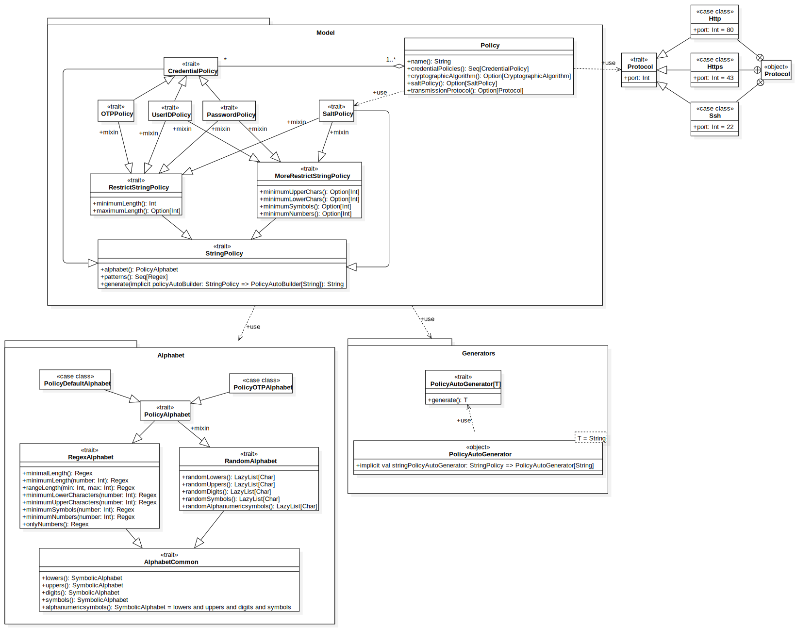
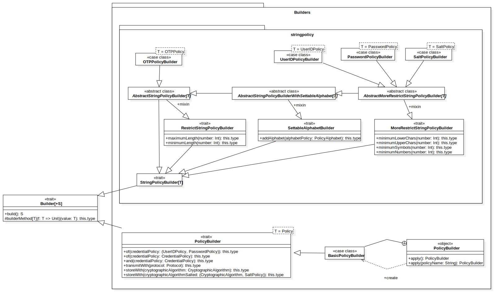
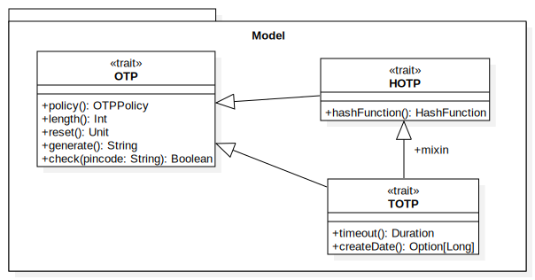
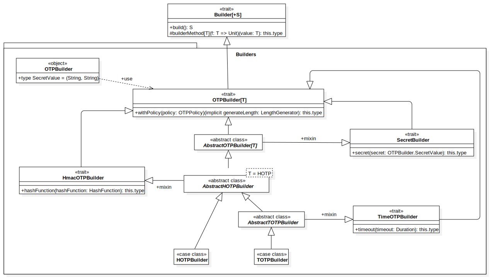

# Design di dettaglio

## Library

### `AbstractBruteForceAttackBuilder`
#### metodi `protected`
Nella classe `AbstractBruteForceBuilder` sono stati inseriti i metodi di configurazione relativi 
agli attacchi bruteforce con visibilità `protected` per permettere alle classi che la estendono di
esporre metodi con nomi più semantici: ad esempio, un attacco bruteforce basato su dizionario 
(generato dal builder `DictionaryAttackBuilder`) richiede un alfabeto in senso generico, quindi un insieme di 
parole con cui generare le stringhe (non obbligatoriamente le parole sono lunghe 1 solo carattere), 
perciò è semanticamente più corretto esporre un metodo nominato `withDictionary` rispetto a `withAlphabet`, 
infatti rispecchia il tipo richiesto dal metodo.

### `Alphabet`
#### `extends Set[String]`
Il trait `Alphabet` estende il trait dei set, in particolare specificando che si tratta di un insieme di stringhe.
Questa estensione è stata fatta per poter utilizzare (e raggiungere) il `Set` all'interno dell'alfabeto stesso 
in modo trasparente e rendere il codice meno verboso.

#### generico rispetto a sè stesso
`Alphabet` è generico rispetto a sè stesso, infatti la sua signature è `trait Alphabet[T <: Alphabet[T]`.
Questa definizione particolare è utile per aiutare il compilatore a conoscere il tipo del valore di ritorno
del metodo `and` (che unisce due alfabeti in una nuova istanza), il quale generalmente ritorna un oggetto dello stesso
tipo dell'alfabeto sul quale si chiama il metodo stesso: ad esempio, se si chiama `and` su un alfabeto di tipo
`Dictionary`, il nuovo alfabeto prodotto sarà anch'esso di tipo `Dictionary`.

### `Builder`
#### `builderMethod`
Il metodo `builderMethod` all'interno del trait `Builder` è stato inserito per rendere meno verboso il codice dei vari 
builder presenti, in quanto incapsula la restituzione del builder stesso. Ciò è stato possibile grazie alla possibilità
di Scala di accettare funzioni come argomenti per altre funzioni. `builderMethod` richiede una funzione che accetta un 
solo valore del tipo specificato e restituisce il tipo `Unit`, che normalmente si associa a una funzione di assegnamento.

### `ConcurrentStringCombinator`
#### restituisce un solo `Option[String]` per chiamata
Questa classe funge da monitor per le combinazioni di stringhe richieste. In questo modo, procedure in esecuzione in 
parallelo non interferiscono tra di loro. Inoltre, fornisce anche una condizione di terminazione, 
in quanto quando restituisce un `Option` vuoto significa che le combinazioni di stringhe richieste sono terminate.


### Policy
//TODO: aggiungere descrizione dei diagrammi Policy

- `Model`
  

- `Alphabet`
  

- `Builders`
  

- `Changers`
  

- `Checkers`
  

- `Defaults`
  

- `Extractor`
  

- `Generators`
  

### OTP (One-Time Password)
//TODO: aggiungere descrizione dei diagrammi OTP

- `Model`
  

  - `Builders` //TODO: modificare UML
    

- `Generators`  //TODO: modificare UML
  

### Cryptography 
Il modulo di crittografia è la parte del sistema adibita a tutte le operazioni crittografiche.
Quest'ultima incapsula gli algoritmi crittografici così come i cifrari che ne permettono le operazioni principali e le utilities ad essi collegati.

#### Algorithm
Gli algoritmi crittografici sono stati modellati tramite una gerarchia che trova la sua *root* nell'interfaccia `CryptographicAlgorithm`.

- `CryptographicAlgorithm`
   Il trait `CryptographicAlgorithm` modella un generico algoritmo di crittografia racchiudendone i metodi core comuni a tutti i suddetti algoritmi.
//TODO add interface_ encryption_algorithm, hashAlgorithm symmetric
Nel framework si è deciso di supportare tre macro tipologie di algoritmi crittografici, in modo da lasciare all'utilizzatore decidere se garantire l'integrità, l'autenticità, o la confidenzialità dei dati.
Di seguito vengono quindi descritte le tre famiglie supportate partendo dalle funzioni hash, per poi arrivare agli algoritmi a chiave simmetrica ed asimmetrica.

  - `HashFunction`
  Il trait `HashFunction`, modella una generica funzione hash[^Hash], esponendone le funzionalità principali.
  Nel framework è stato deciso di mettere a disposizione i più noti algoritmi per fare hashing; nello specifico, non solo funzioni hash considerate attualmente sicure, ma bensì di permettere all'utente di disporre anche di funzioni non sicure, in modo da permettere confronti tra algoritmi resistenti alla crittoanalisi e altri che violano almeno una delle proprietà di sicurezza delle funzioni hash[^Hash-proprietà].
Per rendere il processo maggiormente sicuro è stato deciso lasciare all'utente la possibilità di definire anche un valore di sale per garantire una maggiore sicurezza agli attacchi crittografici.

[^Hash]: Gli algoritmi hash sono particolari tipi di funzioni utilizzati per garantire la confidenzialità dei dati.
Questi ultimi infatti permettono di convertire input di una lunghezza arbitraria, in stringhe di lunghezza fissa, questo mapping deve essere infeasible da invertire e resistente alle collisioni per essere considerato sicuro.

[^Hash-proprietà]: Le proprietà di sicurezza di riferimento delle funzioni hash sono tre: resistenza alla preimmagine, resistenza alla seconda preimmagine e resistenza alla collisione. Per maggiori informazioni consultare \[link to Funzioni Crittofiche di hash!](https://it.wikipedia.org/wiki/Funzione_crittografica_di_hash).
  
 Entrambe le famiglie di algoritmi di encryption estendono da un trait condiviso che ne modella operazioni comuni; questi prende il nome di `EncryptionAlgoritm` .
  
  - `SymmetricAlgoritm`
  Il trait `SymmetricAlgoritm` è una delle due macrocategorie di algoritmi di crittografia; nello specifico questi modella la famiglia di algoritmi di crittografia simmetrica[^CrittografiaSimmetrica].
  
 [^CrittografiaSimmetrica]: Gli algoritmi di crittografia simmetrica sono gli algoritmi crittografici in grado di garantire la confidenzialità in un sistema.
 
Per quanto riguarda questa tipologia di algoritmi si è scelto di mettere a disposizione tre algoritmi piuttosto differenti, il *Cifrario di Cesare*, *DES*, *AES*, anche in questo caso si è scelto di lasciare gli utilizzatori disporre anche di algoritmi la cui insicurezza è nota da lungo tempo [^CifrarioCesareInsicuro] ricordando che lo scopo del framework è quello di permettere all'utente di fare di confronti.

[^CifrarioCesareInsicuro]: L'insicurezza del Cifrario di Cesare è stata evidente fin dal XI a seguito degli studi sulle tecniche di crittoanalisi del arabo *Al-Kindi*. La sicurezza di DES invece è stata messa in questione dal 1997 quando per la prima volta sono stati violati messaggi criptati col suddetto algoritmo. Attualmente AES è l'unico algoritmo proposto ad essere approvato dal *NSA* per il passaggio di informazioni *top secret*. 


 - `AsymmetricAlgoritm`
  Il trait `AsymmetricAlgoritm` come l'interfaccia precedente estende dal trait `EncryptionAlgoritm` modellando in questo caso gli algoritmi a chiave asimmetrica[^AlgoritmiAsimmetrici].
  
[^AlgoritmiAsimmetrici]:  Il modulo di crittografia a chiave asimmetrica, concerne quella categoria di algoritmi in grado di garantire l'autenticità.

Il framework in questo caso mette a disposizione un solo algoritmo *RSA*.
Quest'ultimo viene utilizzato sia per quanto riguarda la generazione delle chiavi stesse da utilizzare durante le operazioni di crittografia, sia per la generazioni delle chiavi stesse.

La libreria separa quelle che sono le caratteristiche statiche degli algoritmi, da quelle che sono le modalità in cui queste vengono sfruttate per l'implementazione delle operazioni crittografiche.
Gli algoritmi appena descritti modellano le prime e di seguito verranno esposti i cifrari, che implementano le seconde.

- `Cipher`
Trait che modella un generico cifrario, esponendo i metodi comuni a tutte le tipologie di cifrari identificati, questi come `CryptographicAlgorithm` rappresenta la *root* per tutte le diverse categorie di cifrari: `SymmetricCipher` e  `AsymmetricCipher`.

Infatti, ad ogni algoritmo di encryption [^EncryptionVSHashing] identificato (algoritmi a chiave simmetrica, o asimmetrica) è stato associato un cifrario che incapsula la logica con cui l'algoritmo viene utilizzato per criptare e successivamente decriptare una segreto.

[^EncryptionVSHashing]: Nel caso del framework le funzioni hash vengono utilizzate per evitare all'utente di salvare le password in chiaro nel database, tuttavia essendo queste non invertibili, perchè l'utente possa controllare l'integrità della password non potrà decriptare il valore hash ma fare un confronto tra il valore hash della password passata in input e quello salvata sul database.

I cifrari sono stati implementati cercando di incapsulare le operazioni comuni in un abstract class applicando il pattern `Template Method` per seguire il principio *DRY*, tuttavia, sebbene il paradigma funzionale si appoggi sull'idea che ogni cosa dovrebbe essere una funzione, in questo caso si è preferito non implementare factories per la creazione di oggetti, in quanto avrebbe potuto impendire l'estensibilità del framework o, minarne la consistenza.

L'entità adibita a tale compito è il `BasicCipher`, classe astratta che fornisce le implementazioni dei metodi di *encryption* e *decryption* oltre che un metodo, `crypto`,  per l'implementazione dell'operazione di cifratura.

  Di seguito vengono descritti i cifrari implementati, nell'ordine prima quelli simmetrici e poi quelli asimettrici.
  
  - `CaesarCipher`
  Cifrario che modella la logica per l'implementazione di un cifrario di Cesare.
  Si tratta dell'unico cifrario a non avvalersi dell'implementazione di base per i cifrari a causa della natura intrinseca dell'algoritmo.
  Questi infatti al contrario degli altri nasce per essere utilizzato con un numero intero come segreto e non con una stringa.
  
  - `AESCipher`, `DESCipher` ed `RSACipher`
 Sono i cifrari che sfruttando rispettivamente gli algoritmi `AES`, `DES` ed `RSA`per l'implementazione delle operazioni di cifratura.
`RSACipher` oltre alle operazioni base della crittografia, un cifrario relativo alla crittografia asimmetrica deve inoltre mettere a disposizione un insieme di operazioni per la gestione dell chiavi sfruttando delle specifiche strutture la più importante delle quali è il: `KeyGenerator`.
    - `KeyGenerator`
  Componente del sistema adibito alla gestione delle chiavi da utilizzare durante le operazioni di crittografia con chiave asimmetrica.
  Questo componente per evitare incosistenze deve essere accessibile solo dal cifrario che lo utilizza e permettere di generare, o caricare delle chiavi pre-esistenti.
      - `KeyPair`: entità che rappresenta una coppia di chiavi: una privata da utilizzare durante l'encryption ed una pubblica per permettere la decryption.
     

### User
- `User`
Il trait `User` modella un generico utente, il quale è caratterizzato da uno `userName` e da una `password`.
- `UserInformation`
Il trait `UserInformation` modella d'altro canto l'informazione che deve essere salvata, questo estende il trait `User` aggiungendo un nuovo campo che permette di memorizzare l'algoritmo utilizzato per la cifratura della password.
Difatti, in questo a differenza di quanto accade per l'entità precedente, la password viene salvata criptata (se l'utente ha deciso di farlo) per evitare attacchi di tipo *credential stuffing*.


Per garantire la consistenza delle informazioni e il rispetto delle policy sono stati implementati due macro tipologie di builder in grado di implementare la costruzione da un lato degli utenti e dall'altro delle informazioni ad esse relative.
I builder afferenti alle due categorie builder, così come tutti i builder del framework, estendendono l'interfaccia  `Builder`.
Nello specifico per l'implementazione dei builder degli utenti si è scelto nuovamente di applicare il principio *Dry* mettendo a disposizione una classe astratta `UserBuilder`che implementi i metodi di base comuni a tutti i builder degli utenti.
Vengono quindi creati due builder specifici per gli utenti: il primo `UserCostumBuilder` in grado di permettere la costruizione di utenti a partire da credenziali e opzionalmente policy scelte dall'utente.
Il secondo  `UserAutoBuilder` che al contrario permette la definzioni di un numero prestabilito di utenti a partire da un set di policy definite dagli utenti.
Quest'ultimo è infatti in grado di generare credenziali randomiche che rispettino le *regole* scelte dall'utilizzatore per il numero richiesto di utenti.

COme per gli User anche per le `UserInformation` è stato implementato un builder in grado assicurarne una corretta istanziazione, questi prende il nome di: `UserInformationBuilder`.


## Pattern di progettazione
### Creazionali
- `Builder` 
Il pattern `Builder` è stato usato in gran parte del framework sia nell'accezione di Scala attraverso l'utilizzo di valori predefiniti nei costruttori, sia nella versione tradizionale del pattern in quanto la maggior parte degli oggetti da costruire
non richiedevano di specificare tutti i parametri di configurazione, restituendo un oggetto di un tipo generale.
Un esempio è `BruteForceAttackBuilder`, il quale costruisce un oggetto di tipo `Attack` e non `BruteforceAttack`.

- `Chaining Method`
Il pattern `Chaining Method` è stato usato implementando i metodi dei builder con il metodo `builderMethod`,
il quale restituisce un riferimento al tipo più specifico possibile del `Builder` su cui è chiamato.
L'uso di questo pattern permette di potenziare la notazione infissa dei metodi di Scala e raggiungere una scrittura di
codice simile al linguaggio naturale.
Un esempio di ciò è la seguente stringa (fonte: `BruteForceAttackBuilderTest`):
```
(new BruteForceAttackBuilder() against myProxy usingAlphabet myAlphabet maximumLength maximumPasswordLength hashingWith HashFunction.MD5() jobs 4 logTo consumer timeout Duration.Zero).executeNow()
```
Si può vedere che la configurazione della costruzione di un attacco (cioè il codice all'interno delle parentesi tonde
più esterne) si avvicina molto alla descrizione a parole (in lingua inglese) di ciò che si richiede.

- `Factory`
Il pattern `Factory` è stato utilizzato nella libreria nell'accezione di Scala, ossia utilizzando il metodo `apply` nei *companion objects* per istanziare oggetti mantenendo privata l'implementazione delle classi.

- `Singleton`
Il pattern `Singleton`, come accaduto per il pattern `Factory` non è stato implementato nella sua versione tradizionale, bensì è stato declinato sfruttando le potenzialità messe a disposizione dal linguaggio Scala.
Nello specifico, gli *Object* sono stati utilizzati spesso come `Singleton` nella libreria, un esempio si può notare nel `KeyGenerator`, struttura responsabile della creazione delle chiavi necessarie alle implementazioni di crittografia asimettrica.
Tale oggetto infatti è stato reso visibile solo a livello di package ed accessibile dal solo cifrario che sfrutta un algoritmo di crittografia asimmetrica, ossia il `RSACipher` che quindi risulta essere l'unico punto di accesso globale al generatore di chiavi. La scelta, è stata fatta per assicurare l'assenza di incosistenze ed errori nella generazione della coppia di chiavi crittografiche.

### Strutturali 

- `Decorator`
Il pattern `Decorator` è stato usato nella dichiarazione del trait `Alphabet` rispetto al trait `Set[String]` di Scala.
Infatti, oltre a estendere il trait, contiene anche un oggetto dello stesso tipo e infatti le operazioni su un alfabeto
sono delegate al set interno, di cui però non si conosce il tipo specifico.

### Comportamentali

- `Template Method`
Il pattern `Template Method` è stato utilizzato nella realizzazione dei cifrari, per poter portare a fattore comune il comportamento di questi nella realizzazione delle operazioni di cifratura evitando inutili duplicazioni di codice.
Questi infatti estendono da una classe astratta `BasicCipher` la quale espone le implementazioni di base dei metodi `encrypt` e `decrypt` lasciando ai cifrari specifici l'implementazione del metodo `crypto` responsabile dell'implementazione delle operazioni di cifratura.
Tali metodi sono infatti invarianti rispetto ai cifrari proposti[^CaesarCipher].

[^CaesarCipher]: L'unica eccezione è rappresentata dal `CaesarCipher` in quanto unico cifrario a non estendere dalla classe astratta per la natura intrinseca dell'algoritmo.

//TODO: AlphabetCommonClasses.alphabenumericsymbols è template method e anche i metodi di trait RegexAlphabet e RansomAlphabet 


## Client

### Observer

// TODO UML ObservableListBuffer

### Factory


// TODO UML AttackFactory

### ScalaFx Task

La simulazione di un attacco potrebbe durare per molto tempo, quindi non sarebbe
accettabile bloccare il thread della gui con una computazione impegnativa.

La libreria ScalaFx offre `Task[T]` una classe utility analoga a `SwingWorker` che permette di
eseguire una computazione non bloccante su un thread diverso da quello di EDT.

Permette inoltre di comunicare con la GUI tramite il metodo `updateMessage` che permette di aggiornare
un StringProperty, `messageProperty`, disponibile alla GUI.

In questo modo si riesce a eseguire la simulazione e stampare su un elemento della gui i log della sua esecuzione.

L'esecuzione del task viene effettuata da un component `SimulationRunnerComponent` responsabile di avviare e di fermare il task in esecuzione.
Questa classe utilizza `ExecutorService` mono-thread (`newSingleThreadExecutor`) per gestire il task. 

// TODO UML Task e runner

### Repositories

// TODO UML SQL e Mongo Repository

### Properties Service

Nello svolgimento del progetto, 

// TODO UML properties Service e SQLRepository

## Organizzazione del codice

Il codice del progetto è diviso in due marco-package: `client` e `library`

### Library 
L'organizzazione del codice della libreria può essere riassunta con il seguente diagramma:


### Client

L'organizzazione del codice del client può essere riassunta con il seguente diagramma:


